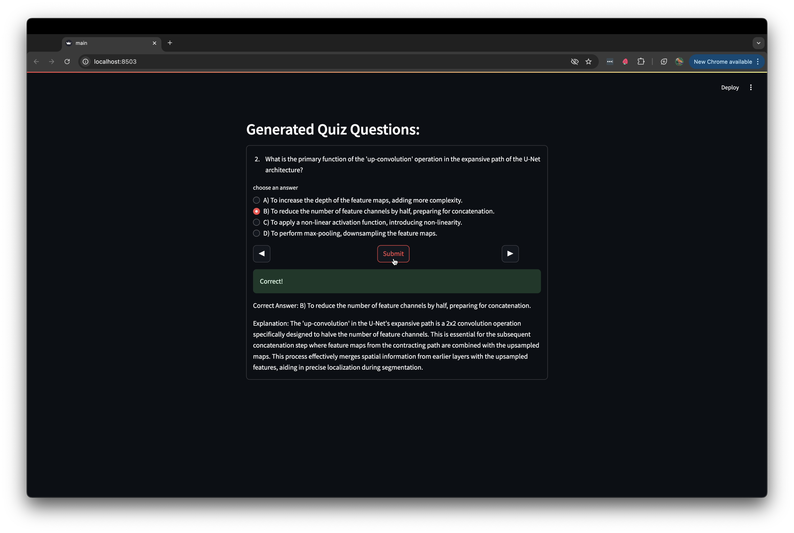

# Gemini Quizzify

Gemini Quizzify is an innovative, Generative AI-powered quiz application that transforms document content into engaging, topic-specific quizzes. Leveraging cutting-edge machine learning models and Google's advanced AI technologies, this tool offers a unique approach to learning and assessment.

## 🚀 Features
- **Document-Based Quiz Generation:** Upload your documents and let the AI create custom quizzes based on the content.
- **Topic Customization**: Specify your desired quiz topic for targeted learning experiences.
- **Advanced AI Integration:** Utilizes Google's Gemini and Vertex AI API for sophisticated document processing and quiz generation.
- **Interactive User Interface:** Built with Streamlit for a seamless, user-friendly experience.
- **Machine Learning-Powered:** Employs text embedding models for enhanced understanding and question generation.
- **Multiple-Choice Questions:** Generates diverse multiple-choice questions with explanations.
- **Customizable Quiz Length:** Choose the number of questions you want in your quiz (up to 10).
- **Persistent Vector Store:** Uses ChromaDB to store document embeddings for faster retrieval and quiz generation.

## 🛠 Technology Stack
- **Google Vertex AI:** Used for both generating quiz questions (via LLM) and embedding documents (via Vertex AI embeddings).
- **Google Cloud Platform:** For authentication and project management
- **Langchain:** Powers the integration between various LLMs and embeddings for question generation.
- **ChromaDB:** Vectorstore for storing and retrieving document embeddings.
- **Streamlit:** Frontend framework for building the user interface.
- **PyPDF Loader:** For processing PDF documents
- **Python:** Core programming language used for the backend logic.

## 📁 Project Structure

- **`main.py`**: This is the entry point of the application. It initializes the document ingestion, embedding, and quiz generation processes, providing an interactive UI using Streamlit. Users can upload documents, specify quiz topics, and generate quizzes.
- **`quiz_algo.py`** : Core algorithm for generating quiz questions
- **`quiz_manager.py`**: Manages the quiz flow and user interaction
- **`chroma_collection_creator.py`**: Handles creation and querying of the Chroma vector database
- **`embedding_client_creator.py`**: Manages the creation of text embeddings using Google's Vertex AI
- **`document_ingestion.py`**: Processes uploaded PDF documents

## ⚙️ Setup & Installation

1. **Clone the repository**:
   ```bash
   git clone https://github.com/ironghost007/GeminiQuizzify.git
   cd GeminiQuizzify

2. **Install the required dependencies**:
   ```bash
   pip install -r requirements.txt

3. **Set up Google Cloud Vertex AI**:

- Ensure that you have a Google Cloud project with Vertex AI enabled.
- Create service account credentials and set them up in your environment.
- Place your `auth_key.json` file in the project root directory
- Ensure the `GOOGLE_APPLICATION_CREDENTIALS` environment variable is set

4. **Run the application**:
    ```bash
    streamlit run main.py
    
## 📘 Usage
1. Launch the application and upload your PDF documents.
2. Enter the desired quiz topic and select the number of questions.
3. Click "Submit" to generate the quiz.
4. Answer the multiple-choice questions and receive instant feedback.

## 🧠 How it Works
1. **Document Ingestion**: Upload documents via the interface. The application processes and breaks down the document into chunks, which are stored in ChromaDB for later retrieval.

2. **Embedding Creation**: The application creates vector embeddings of the document using Google Vertex AI. These embeddings help the application understand the document's content.
3. **Quiz Generation**: Once a topic is selected, the application uses the Vertex AI LLM to generate quiz questions related to that topic. It ensures that the generated questions are unique and contextually accurate.
4. **Quiz Presentation**: The generated quiz is displayed to the user with multiple-choice answers and explanations for the correct answers.

## 💻 Screenshots
### Quiz Builder




## 🤖 Future Enhancements
- Support for additional document types.
- Real-time collaboration features allowing multiple users to create and take quizzes together.
- Expansion to other languages and regions with multilingual support.

## 🛡 Security Note
Ensure that your Google Cloud credentials are kept secure and not shared publicly. The project uses environment variables and local file paths for authentication, which should be properly configured in your deployment environment.

## 🤝 Contributing
Contributions, issues, and feature requests are welcome! Feel free to check issues page.

## 📜 License
MIT License

## 🙏 Acknowledgements
This project is based on [mission-quizify](https://github.com/radicalxdev/mission-quizify), developed by [radicalxdev](https://github.com/radicalxdev). We thank them for providing the foundation for this project.

- [Radical AI](https://www.radicalai.org/) - For providing the challenges and inspiration.
- [Streamlit](https://streamlit.io/) - For the development of the user interface.
- [Google Cloud Platform](https://cloud.google.com/) - For the APIs and services used.
- [Langchain](https://langchain.com/) - For the text embeddings technology.
